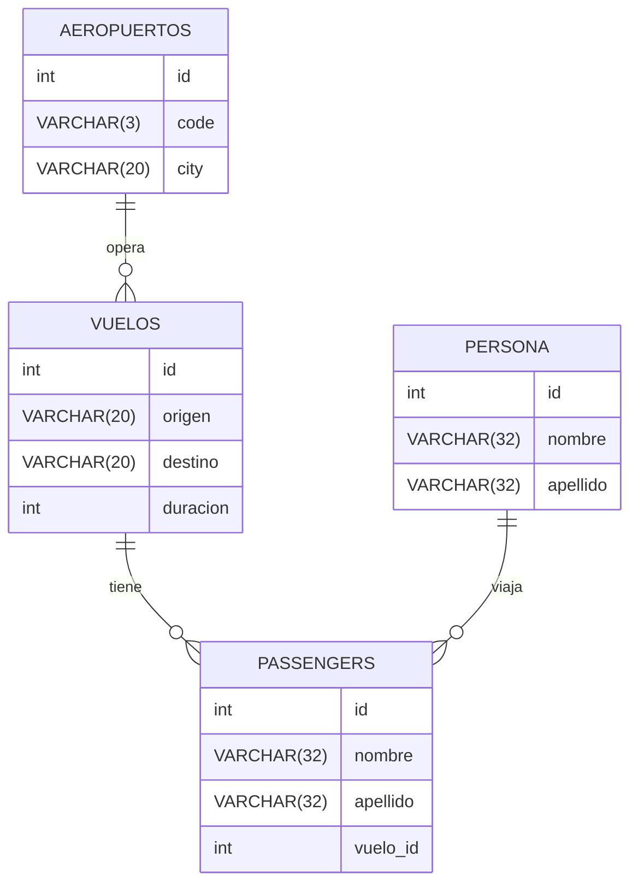

# Base de Datos de Gestión de Vuelos

Este archivo describe la estructura de las tablas de la base de datos de gestión de vuelos, el diccionario de datos y el diagrama entidad-relación (DER).

## Diagrama Entidad-Relación (DER)

## Diccionario de Datos

### Tabla: `VUELOS`

Esta tabla almacena información sobre los vuelos disponibles, incluyendo el origen, destino y duración.

| Campo       | Tipo de Dato | Descripción                                             |
|-------------|--------------|---------------------------------------------------------|
| `id`        | int      | Identificador único del vuelo (clave primaria).         |
| `origen`    | VARCHAR(20)       | Nombre de la ciudad de origen del vuelo.                |
| `destino`   | VARCHAR(20)       | Nombre de la ciudad de destino del vuelo.               |
| `duracion`  | int      | Duración del vuelo en minutos.                          |

### Tabla: `PERSONA`

Esta tabla almacena información sobre las personas registradas en el sistema.

| Campo       | Tipo de Dato | Descripción                                             |
|-------------|--------------|---------------------------------------------------------|
| `id`        | int      | Identificador único de la persona (clave primaria).     |
| `nombre`    | VARCHAR(32)       | Nombre de la persona.                                   |
| `apellido`  | VARCHAR(32)       | Apellido de la persona.                                 |

### Tabla: `PASSENGERS`

Esta tabla representa a los pasajeros que están asociados a un vuelo específico, además de contener información básica de los pasajeros.

| Campo       | Tipo de Dato | Descripción                                             |
|-------------|--------------|---------------------------------------------------------|
| `id`        | int      | Identificador único del pasajero (clave primaria).      |
| `nombre`    | VARCHAR(32)       | Nombre del pasajero.                                    |
| `apellido`  | VARCHAR(32)      | Apellido del pasajero.                                  |
| `vuelo_id`  | int      | ID del vuelo en el que viaja el pasajero (clave foránea, referencia a `VUELOS.id`). |

### Tabla: `AEROPUERTOS`

Esta tabla contiene información sobre los aeropuertos operativos en el sistema.

| Campo       | Tipo de Dato | Descripción                                             |
|-------------|--------------|---------------------------------------------------------|
| `id`        | int      | Identificador único del aeropuerto (clave primaria).    |
| `code`      | VARCHAR(3)       | Código IATA del aeropuerto (tres letras).               |
| `city`      | VARCHAR(20)       | Ciudad a la que pertenece el aeropuerto.                |
